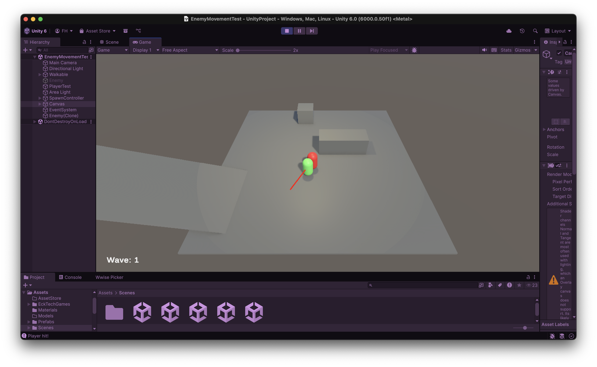
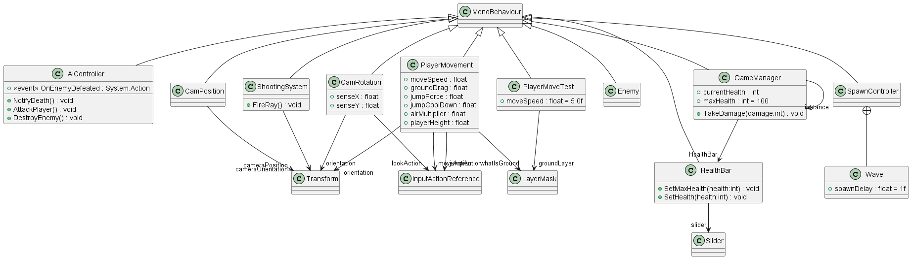

# CCL4 - Group 8 Portfolio

Not final

### Mockup
The test scene shows a player capsule that is followed by the enemy capsule that shoots out a raycast for the player hit. The player will be followed around by the enemy and the player needs to fight off the waves of enemies, which are displayed in the UI.

### System Design
#### Player:
- Shoots enemies with weapons.
- Deals damage to enemies when hitting them with the weapons. Different weapons have different settings for the raycast.
- Takes damage from enemies within range.
- Increases score by shooting enemies.

#### Spawn Controller:
- Once the player has defeated all enemies the next wave will start.
- The waves are defined beforehand with the enemies stored in an array, to select different types of enemies, and the delay between spawns for each wave.
- The Controller stores locations for the spawn points of the enemies.
- One spawn location is randomly picked from all locations.
- The wave text is updated.

#### AI Controller:
- Navigates to the player with obstacle avoidance.
- Deals damage to the player when in range.
- Takes damage from the players weapon.

#### Environment:
- Explosive barrels scattered around the level for damage to multiple enemies.

### System infrastructure
#### Class diagram (NOT FINISHED, still needs to be consolidated - still a lot of test scripts that will not be used in the final version):
